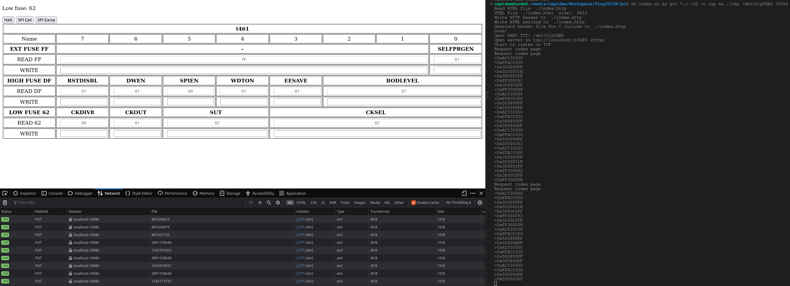

# ISP PC software

This software will open a TCP server to interactive with user and a TTY (UART) connection to interactive with ISP.

## Client-side

This software use webpage to serve the client-side GUI to reduce UI related code and compute on this software. The server-side of this software will host a mini webserver on a localhost port. User can use web browser to access the client-side program.

Using webpage (HTML + CSS + JS) not only making the GUI programming easier compare to using other methods, but also give the user the ability to customlize the UI and workflow. Users are welcome to modify any of the HTML, JS and CSS files. It is also possbile to open the server port to network for remote programming.

There is no need to compile the client-side code, web browser does this on-the-fly, and they are not slow (for modern PC).

## Server

The server-side of this software is in fact a simple HTTP server and a UART translator.

GET request from client-side via XHR lets the server to return webpage related resources, such as HTML file, JS file...

POST / PUT request lets the server to translate the request from HTTP to UART and relay the request to the ISP. After ISP response, the server return the response to the client.

DELETE request halts the software.

Compile with ```gcc *.c -O2 -o isp```.

## Execute

First, connect the ISP to PC.

Execute with ```./isp tty port``` where ```tty``` is the UART device and ```port``` is the port number to open server. Example: ```./isp /dev/ttyUSB0 10086```.

Use web browser (I use Firefox for dev) and go to ```localhost:port``` where ```port``` is same as the previous step. Example: ```localhost:10086```. You may open page inspector to see some logs in console. This will send a ```GET``` request to the server to get the client-side software from the server. A blank page then displayed in the web browser, the server-side software also says "Request index page".

Click any button on this page will send ```PUT``` request to the server. The server will translate the request from HTTP to UART and send it to the ISP. After ISP response, the data from ISP in UART will be translated into HTTP response body and returned back to the client.

The first step is to use "SPI Get" to enable programming and read signature bytes from the target AVR. If the signature matches with a known one in the configuration JSON, this software will display a table of the NVME of the target AVR. Use "X READ" to read each of them (example, read hfuse), the software will read the specific data from the target AVR and display them in the table.

To porperly close the software, use the "Halt". This will send a ```DELETE``` request which request the server to exit (this performs some house-cleanning before exit). After this operation, you must restart the server-side software and refresh the client-side page to use this software again.

